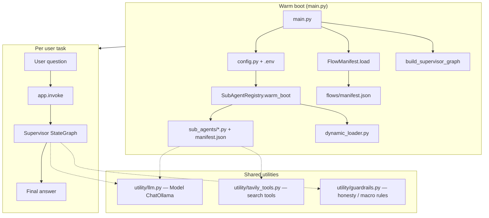
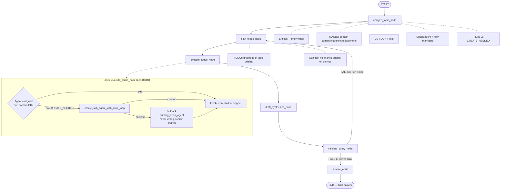
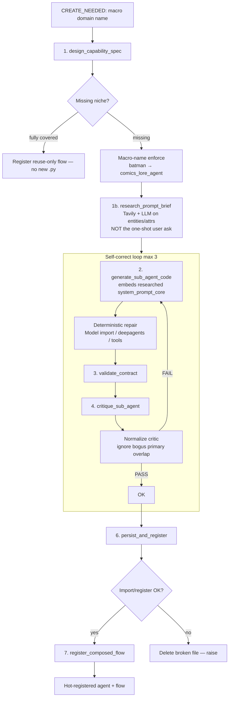
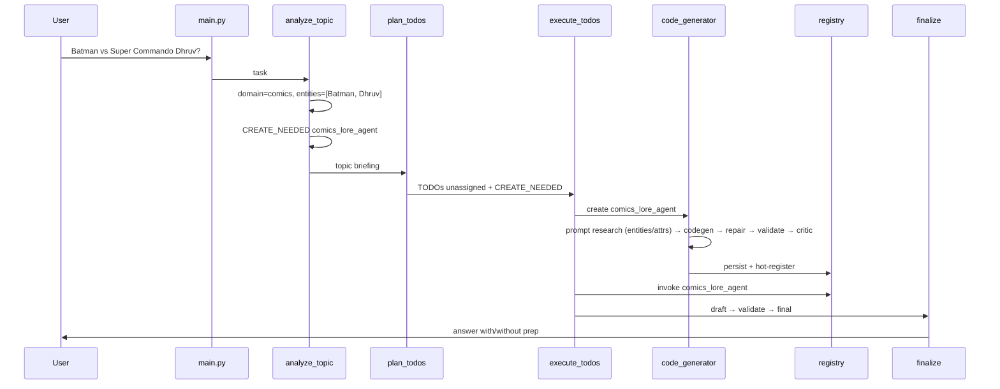

# Evolving Deep Agents — Flow Diagrams

Self-evolving multi-agent system: warm-boot registry → topic analysis → TODO plan →
execute (reuse / create / invoke) → draft → validate → finalize.

---

## 1. System overview



---

## 2. Supervisor graph (runtime)



---

## 3. Sub-agent creation pipeline (`code_generator.py`)



---

## 4. Module map

```mermaid
flowchart LR
    subgraph Entry
        main.py
    end

    subgraph Orchestration
        graph.py
        state.py
        code_generator.py
    end

    subgraph Persistence
        registry.py
        dynamic_loader.py
        flow_manifest.py
        sub_agents["sub_agents/"]
        flows["flows/"]
    end

    subgraph Utility
        llm["utility/llm.py"]
        tavily["utility/tavily_tools.py"]
        guard["utility/guardrails.py"]
        config.py
    end

    main.py --> graph.py
    main.py --> registry.py
    main.py --> flow_manifest.py
    graph.py --> state.py
    graph.py --> code_generator.py
    graph.py --> registry.py
    graph.py --> flow_manifest.py
    code_generator.py --> registry.py
    code_generator.py --> flow_manifest.py
    registry.py --> dynamic_loader.py
    registry.py --> sub_agents
    flow_manifest.py --> flows
    graph.py --> llm
    code_generator.py --> llm
    sub_agents --> llm
    sub_agents --> tavily
    graph.py --> guard
```

---

## 5. Data artifacts

| Path | Role |
|------|------|
| `sub_agents/*.py` | Persisted specialist agents (`build_agent`, `AGENT_*`) |
| `sub_agents/manifest.json` | Agent name / description / capabilities index |
| `flows/manifest.json` | Multi-agent workflows + problem coverage |
| `.env` | `TAVILY_API_KEY`, Ollama settings via `config.py` |

---

## 6. End-to-end example (comics question)


